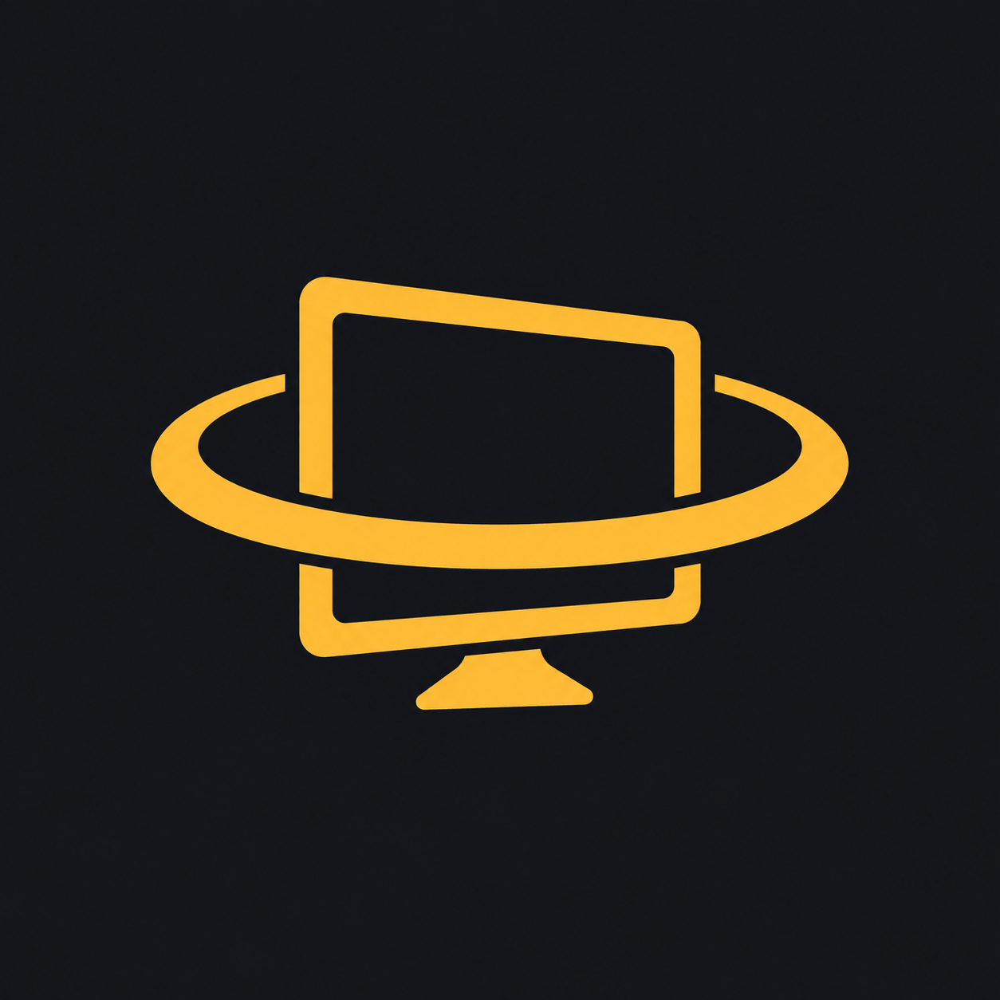

# DeskHalo

**Your Windows desktop, in your Quest workspace.**

DeskHalo connects a Windows host to a native OpenXR Quest app over USB or local Wi-Fi. Arrange desktop panels in VR, keep your room visible with passthrough, and see physical keyboard feedback beside your screens.

[Download the preview](https://github.com/ItzGlace/DeskHalo/releases) · [Build instructions](docs/building.md) · [Custom models](docs/custom-models.md) · [MIT license](LICENSE)

## Features

- Up to three VR panels with adjustable size, distance and monitor selection.
- 720p, 1080p, 1440p, 4K and 8K resolution requests, negotiated to headset capabilities.
- 15–120 FPS stream targets, separate headset refresh control, hardware H.264 encoding when available.
- USB through ADB reverse, Windows hotspot, or a shared local router.
- Hideable 100%, 80% and 60% keyboard layouts with live key highlights, compact clock and a 5° tilt. Size and place the keyboard by framing it with your fingers.
- Passthrough, articulated hands, Touch controller models and button feedback. Import custom OBJ, GLB or FBX skins.
- Saved workspace profiles, file transfer, PC audio to Quest and Quest microphone playback on the PC.
- Optional independent Windows extended desktops through the separately installed Virtual Display Driver.

## Install and connect

1. Download the **Windows x64 MSI** and **Quest APK** from Releases. The MSI installs for your Windows user and adds a Start menu shortcut. This preview MSI is unsigned; the APK uses a development signing certificate.
2. Sideload the APK onto a Quest with developer mode and USB debugging enabled: `adb install -r DeskHalo-Quest-v0.6.0-preview.apk`.
3. Open **DeskHalo Host** and click **Start sharing**.
4. For USB, run `adb reverse tcp:47654 tcp:47654` and use `127.0.0.1` in Quest. For Wi-Fi, use the PC's local address shown by the host. Enter the six-digit pairing code.
5. Press the **left controller ≡ button** to show or hide settings. The right Meta/Oculus button belongs to the headset system.

The MSI includes .NET and Windows App SDK runtimes. Extra desktop monitors require the [Virtual Display Driver](https://github.com/VirtualDrivers/Virtual-Display-Driver/releases), installed separately. The setup button opens its official releases. Adding a VR panel alone does not create a Windows monitor.

## Preview status

Quest 2 is the tested headset. Other Quest models are not individually validated. The Android minimum API is 29; this alone does not guarantee compatibility with every Quest runtime.

Resolution and FPS settings are requests, not guarantees. Multiple 4K streams, 8K and 120 FPS can exceed encoder, network or decoder capacity. Gaming mode reduces encoder buffering; it does not change contrast. HDR capture and colour-managed wide-gamut workflows are not supported in this SDR preview.

Keyboard feedback reports physical PC key states; it is not optical keyboard recognition. Rigged custom hands need compatible joint names and axes. Quest microphone audio plays through the PC output; it does not create a virtual microphone device. See [v0.6 validation](docs/version-0.6.md) for completed checks and remaining visual checks.

Pairing gates the local endpoints. Traffic uses unencrypted HTTP: use USB or a trusted local network, and do not expose the port to the internet. No cloud account is needed to use DeskHalo.

## Source

| Folder | Purpose |
| --- | --- |
| android/ | Java UI, MediaCodec and native OpenXR/GLES renderer |
| windows/ | C# WinUI host, capture, H.264, input and transfers |
| installer/ | WiX MSI definition |
| scripts/ | Build, connection and optional driver helpers |
| tests/ | Protocol, stream parsing and keyboard geometry checks |
| docs/ | Build instructions and implementation notes |

DeskHalo source is MIT licensed. Bundled assets and dependencies retain their own licenses; see [third-party notices](THIRD_PARTY_NOTICES.md).
